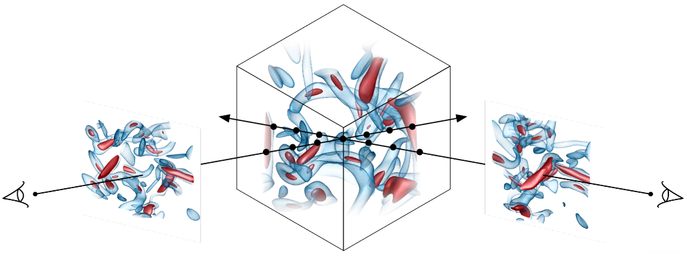

# PVNeRF-Synthetic: Using ParaView to Generate NeRF-Synthetic Dataset for Your Visualization Scene

## Description
This toolkit is designed for generating VolVis multi-view images dataset in NeRF-Syntheti/Blender format with paraview render and helping researchers study NeRF and its realted techniques in application of scientific visualization. 

## Setup

First, clone this repo and download Paraview:
```bash
git clone https://github.com/TouKaienn/PVNeRF-Synthetic.git
```

We use the NVIDIA IndeX plugin in Paraview to render pretty DVR images with lighting. You need to download Paraview at [here](https://www.paraview.org/download/) and put the unzip folder into "/resources" dir.
We recommend you to download [Paraview-5.11.1-MPI-Linux-Python3.9-x86_64](https://www.paraview.org/paraview-downloads/download.php?submit=Download&version=v5.11&type=binary&os=Linux&downloadFile=ParaView-5.11.1-MPI-Linux-Python3.9-x86_64.tar.gz), which is the default Paraview version this toolkit use.

Second, create a new conda environment:

```bash
conda env create -n paraview python=3.9
conda activate paraview
```

Note that the name of conda environment must be "paraview" and the python version must be aligned with you Paraview Python version (e.g., if your Paraview version is "Paraview-5.11.1-MPI-Linux-Python3.9-x86_64", the python version in your conda environment should be python 3.9).

Then, install other dependencies:
```bash
pip install -r requirements.txt
```
Finally, you need to set global environment variable ```PV_VENV``` to your "paraview" conda environment, so the paraview python (pvpython) can call basic functions in other python package (e.g., "torch") for implementing your own functions easily.

You can do this by adding following in your `.zshrc` or `.bashrc` file:
```bash
export PV_VENV=/path/to/your/conda/paraview/env
```

## Run
After setting up, you can test your installation by running `volRenderDataset.sh` under `scripts` folder:
```bash
cd scripts
bash volRenderDataset.sh
```
If everything OK, you can see a `vortsRGBa` folder in the root dir, which is multi-view image dataset for vortex volume in `Data` dir.
Feel free to run some novel view synthesis models on `vortsRGBa`, such as [InstantNGP](https://github.com/NVlabs/instant-ngp) or [3DGS](https://github.com/graphdeco-inria/gaussian-splatting).

## Custom your own VolVis scene
To render your own VolVis scene, you can follow three steps: `Render your volume in Paraview (optional)`, `Save state file`, and `Set dataset config`.

### 1. Render your volume in Paraview (optional)
You can strat with rendering your volume in Paraview, try to adjust the transfer function or other parameters to get satisfied rendering.

More info about Paraview usage can be found at [Paraview documentation](https://docs.paraview.org/en/v5.11.2/UsersGuide/introduction.html)

### 2. Save state file
After settle down the transfer function or other rendering parameters (you can also set these parameters in our code, please check `apps/volTFRenderDataset.py`), save a paraview state file following [Saving state](https://docs.paraview.org/en/v5.11.2/UsersGuide/savingResults.html#saving-state)

### 3. Set dataset config
In `ConfigFiles/DataConfig.json`, register your volume with following format:
```json
{
...
"YourVolume": {
        "state_path":"./ParaviewState/xxx.pvsm", <- your paraview state file path
        "data_path":"./Data/xxx.raw", <- your volume data path
        "total_timesteps": 1, <- total timesteps (if time varying)
        "timestep_offset":0, <- start with timestep 1+timestep_offset
        "dim" : [128,128,128], <- volume dimension
        "r" : 375 <-control the distance between the camera to volume
    }
...
}
```
Then you can modify `dataset=("vorts")` in for bash scripts in `scripts` folder to `dataset=("YourVolume")` to generat your multi-view dataset.


## FAQ
**Q:** When I run bash file in scripts folder, I got error: ```"qt.qpa.plugin: Could not load the Qt platform plugin "xcb" in "" even though it was found."```

**A:** Try to solve this by installing PyQt5 dependencies with:
```bash
sudo apt-get install '^libxcb.*-dev' libx11-xcb-dev libglu1-mesa-dev libxrender-dev libxi-dev libxkbcommon-dev libxkbcommon-x11-dev
```


## Ackowledgement and Citation
Many thanks to [Siyuan Yao](https://github.com/JCBreath) and [Leo Ai](https://github.com/KuangshiAi) for their kindly help during developing or testing this toolkit.


If you find this work useful, a citation will be appreciated via:
```
@misc{PVNeRF-Synthetic,
    title={{PVNeRF-Synthetic}},
    howpublished={\url{https://github.com/TouKaienn/PVNeRF-Synthetic}},
    note={Accessed:2024-10-30}
}
```

